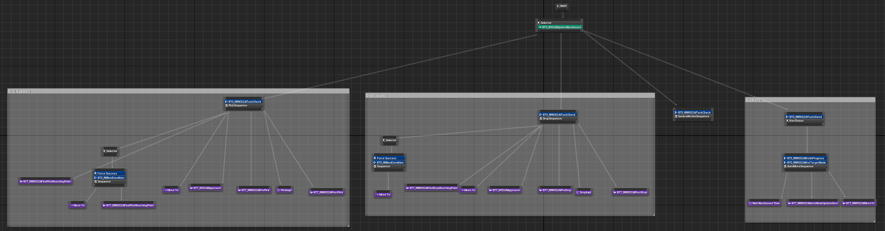
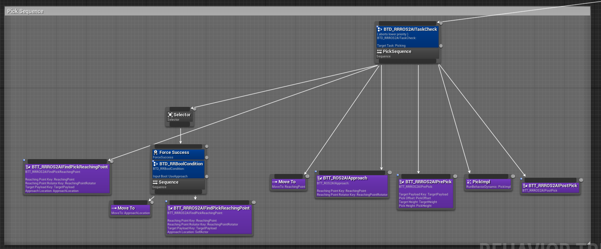
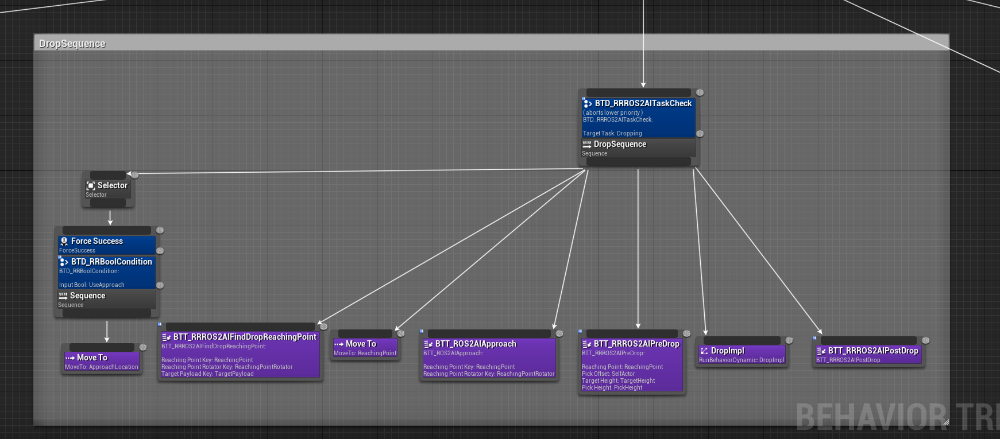
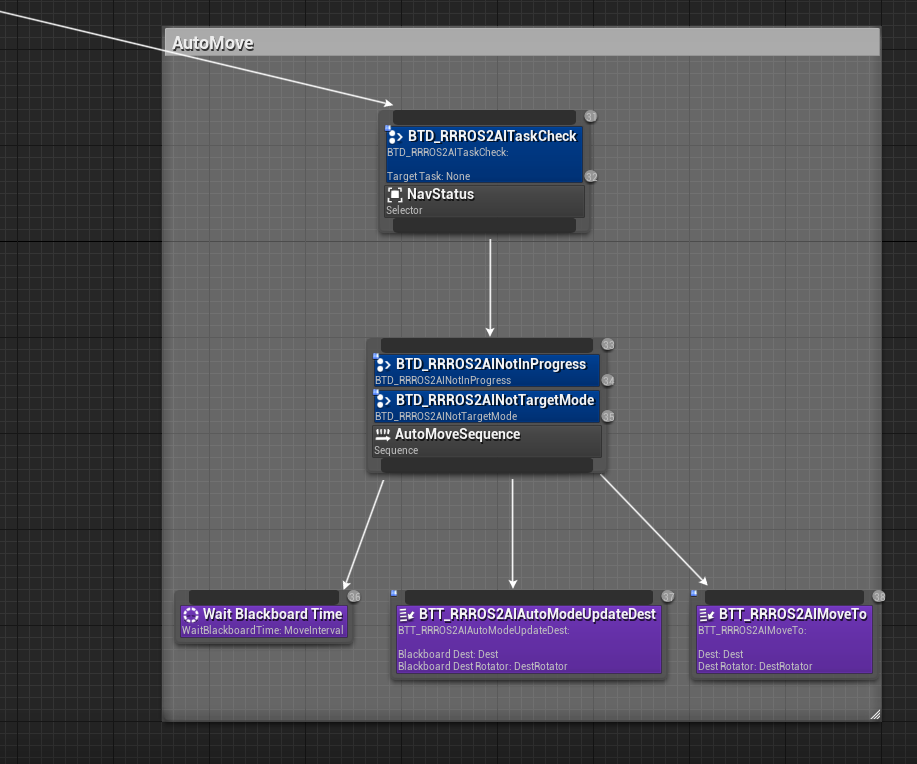
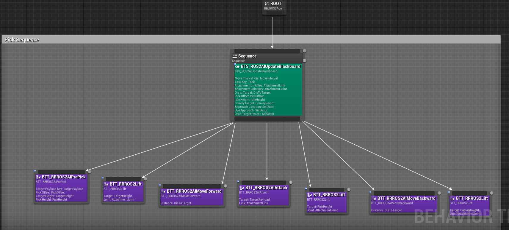
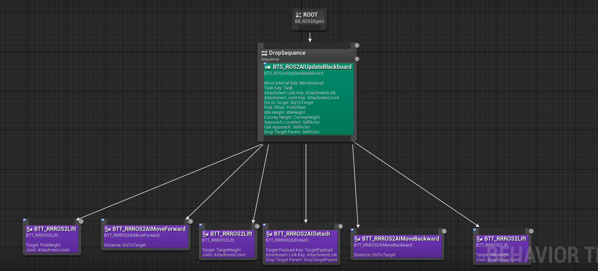
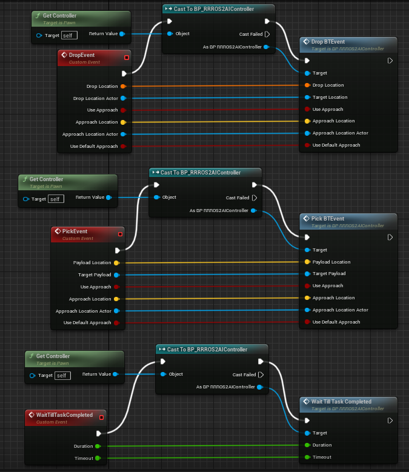

AI Character/Robot
==================

AI Overview
-----------

AI Character/Robot is an actor controlled via `BP_ROSAIController`. It has preset
movements such as pick, drop, and navigation. The primary purpose of these actors
is to simulate humans, non-robot components such as manually controlled forklifts,
or off-the-shelf robots that you won't develop but exists in the environment.
These actors help simulate robot interactions with dynamic objects in environments like warehouses.

Basic AI functionality such as pick/drop/move is implemented via behavior tree in BP_RRROSAIController.
The main reason to implement logic in controller instead of actor is to
support both child class of RRBaseRobot and Character.

RRAIRobotROSController is parent class of BP_RRROSAIController which has
implementention of UE navigation system movement functionality in C++. Those primitive
API’s are used from behavior tree in BP_RRROSAIController.

BP_RRAIBaseRobot and BP_ROSSimpleCharacter uses BP_ROSAIController as controller. It
is expected to overwrite function/behavior in those child actor classes to implement custom
pick/drop/etc actions.

*Following video are examples in  `rclUE-Examples <https://github.com/yuokamoto/rclUE-Examples>`_
and `UEROSAssets <https://github.com/yuokamoto/UEROSAssets/tree/ai_robots2>`_
repositories.

*Please check LevelBP of
`Warehouse Map <https://github.com/yuokamoto/rclUE-Examples/blob/main/Content/Maps/Warehouse.umap>`_
in
`rclUE-Examples <https://github.com/yuokamoto/rclUE-Examples>`_
for how to control AI character/robot from UE

*Please check
`warehouse_client.py <https://github.com/yuokamoto/rclUE_client_example/blob/main/rclUE_client_example/rclUE_client_example/warehouse_client.py>`_
in  `rclUE_client_examples <https://github.com/yuokamoto/rclUE_client_example>`_
for how to control AI character/robot from ROS 2

.. video:: ../_static/videos/warehouse_sim.mp4
    :width: 750
    :height: 450

*Video: Warehouse Sim*

.. video:: ../_static/videos/fork_pick_drop_ros.mp4
    :width: 750
    :height: 450

*Video: Forklift Pick/Drop From ROS*

.. video:: ../_static/videos/character_pick_drop_ros.mp4
    :width: 750
    :height: 450

*Video: Character Pick/Drop From ROS*

Basic Behaviors
^^^^^^^^^^^^^^^^

AI characters can move using two methods:

- **UE Navigation System Movement**:
    Utilizes Unreal Engine's navigation system, requiring a navigation mesh in the map.

- **Direct Movement**:
    Uses `SetActorLocation` and `SetActorRotation` for linear and rotational movement, often for tasks such as picking up or dropping objects.

Combination Behaviors
^^^^^^^^^^^^^^^^^^^^^

- **Auto Movement**:
    The robot can move randomly or sequentially through predefined goal sequences, or move randomly within a defined area.

    - **SEQUENCE**: Moves repeatedly through a given `GoalSequence`.
    - **RANDOM_SEQUENCE**: Selects a random destination from `GoalSequence`.
    - **RANDOM_AREA**: Selects random destinations within a specified bounding box.

- **Pick/Drop**:
    Combines UE navigation system movement with direct movement
    (forward/backward) to approach or depart from the target payload or point, lifting
    up or down, and attaching or detaching the object. There is also an option to
    move to another approach location before moving to the target location, which helps
    pawn to approach the target from specific direction.

- **General Action**:
    A virtual event that can be customized in child classes. The action is
    triggered by a JSON string argument and allows for flexible custom behavior.

Behavior Trees
^^^^^^^^^^^^^^^

**BT_ROS2Agent**
`BT_ROS2Agent` is a base behavior tree that switches between navigation, pick, drop,
and general actions. In the navigation part, it switches Auto Movement modes depending
on the current mode. In the pick/drop part, it includes sub-behavior trees in
`PickImpl/DropImpl`, which are set in the `PickImplBehavior/DropImplBehavior`
variables of `BP_RRROSAIController`.

   ROS2Agent Behavior tree

   Pick action part of ROS2Agent Behavior tree

   Drop action part of ROS2Agent Behavior tree

   Navigation movement part of ROS2Agent Behavior tree

**BT_ROS2RobotPick/BT_ROS2RobotDrop**
These are the default sub-behavior trees used for `PickImpl/DropImpl` actions.

   Pick sub tree

   Drop sub tree

AI Controller
-------------

RRAIRobotROSController
^^^^^^^^^^^^^^^^^^^^^^

`RRAIRobotROSController` contains basic movement functionality in C++. It supports
movement using Unreal Engine's navigation system and allows for direct linear and
rotational movement via `SetActorLocation` and `SetActorRotation`. Additionally,
it provides a basic ROS 2 interface for external control.

Parameters for RRAIRobotROSController
^^^^^^^^^^^^^^^^^^^^^^^^^^^^^^^^^^^^^^^^^^

.. list-table::
   :header-rows: 1

   * - Param Name
     - Type (Default)
     - Note
   * -  **ROS JSON SPAWN PARAMETER**
     -
     -
   * - /debug
     - bool (false)
     - Enables debug logging.
   * - /mode
     - int32 (0)
     - Defines movement mode:
       0. Manual
       1. Sequential loop movement through `GoalSequence`
       2. Random through `GoalSequence`
       3. Random area movement which defined with origin and random_move_bounding_box
   * - /speed
     - float (depends on movecomponent)
     - Linear moving velocity. it is paassed to movecomponent
   * - /angular_speed
     - float  (depends on movecomponent)
     - Angular velocity. it is passed to movecomponent
   * - /acceleration
     - float (depends on movecomponent)
     - Linear acceleration velocity. it is passed to movecomponent
   * - /acceptance_radius
     - float (10 cm)
     - Radius within which the robot considers the target reached.
   * - /orientation_tolerance
     - float (5°)
     - Angular tolerance for completing navigation.
   * - /random_move_bounding_box
     - vector({x:1, y:1, z:1})
     - Bounding box used with mode=RANDOM_AREA
   * - /origin
     - transfor or string(nullptr)
     - Origin used with mode=RANDOM_AREA. If it is string, acotor with name is used as origin
   * - /goal_sequence
     - transform
     - Goal sequences which is uses with mode=SEQUENCE or RANDOM_SEQUENCE

ROS 2 API for RRAIRobotROSController
^^^^^^^^^^^^^^^^^^^^^^^^^^^^^^^^^^^^^^^^^^

.. list-table::
   :header-rows: 1

   * - Topic Name
     - Msg Type
     - Note
   * -  **SUBSCRIBE**
     -
     -
   * - /pose_goal
     - `geometry_msgs/msg/PoseStamped <https://docs.ros.org/en/noetic/api/geometry_msgs/html/msg/PoseStamped.html>`_
     - Sets a navigation goal for the robot.
   * - /actor_goal
     - `example_interfaces/msg/String <https://docs.ros2.org/foxy/api/example_interfaces/msg/String.html>`_
     - Sets a navigation goal based on an actor's name.
   * - /set_mode
     - `example_interfaces/msg/Int32 <https://docs.ros2.org/foxy/api/example_interfaces/msg/Int32.html>`_
     - Sets the robot's movement mode.
        0. Manual
        1. Sequential loop movement through `GoalSequence`
        2. Random through `GoalSequence`
        3. Random area movement which defined with origin and random_move_bounding_box
   * - /set_speed
     - `example_interfaces/msg/Float32 <https://docs.ros2.org/foxy/api/example_interfaces/msg/Float32.html>`_
     - Adjusts the robot's linear speed.
   * - /set_angular_speed
     - `example_interfaces/msg/Float32 <https://docs.ros2.org/foxy/api/example_interfaces/msg/Float32.html>`_
     - Adjusts the robot's rotational speed.
   * -  **PUBLISH**
     -
     -
   * - /nav_status
     - `example_interfaces/msg/Int32 <https://docs.ros2.org/foxy/api/example_interfaces/msg/Int32.html>`_
     -
        0. IDLE: not moving
        1. AI_MOVING: moving with UE navigation system
        2. LINEAR_MOVING: linear moving without AI
        3. ROTATING: Rotating without AI

BP_RRROSAIController
^^^^^^^^^^^^^^^^^^^^^

BP_RRROSAIController is a child class of RRAIRobotROSController and has implementation
for pick, drop, and other actions in addition to actor movements. These actions are implemented
in a behavior tree, and can be customized via the behavior tree in child classes.

Pick/Drop actions include an optional parameter for approaching a location before starting the
pick/drop action. This allows the actor to approach the target object from a specific direction.

If the target payload is a child class of BP_PayloadBase, the defined approach locations in
BP_PayloadBase can also be used.

The general action is an interface to execute actions specific to the actor. The argument to the
general action is a JSON string, which is parsed and the action is implemented in child classes.

BP Parameters for BP_RRROSAIController
^^^^^^^^^^^^^^^^^^^^^^^^^^^^^^^^^^^^^^^^^^

.. list-table::
   :header-rows: 1

   * - Param Name
     - Type (Default)
     - Note
   * - PickImplBehavior
     - Behavior tree
     - Sub-behavior tree used from PickImpl in BT_ROS2Agent.
   * - DropImplBehavior
     - Behavior tree
     - Sub-behavior tree used from DropImpl in BT_ROS2Agent.

BP_RRROSAIController UE　API
-----------------------------

.. list-table::

    *   - .. figure:: ../images/bp_pick_bt_event.png
        - .. figure:: ../images/bp_drop_bt_event.png
        - .. figure:: ../images/bp_general_action.png

.. list-table::
   :header-rows: 1

   * - Function Name
     - Input
     - Type
     - Description
   * - PickBTEvent
     - PayloadLocation
     - vector
     - This or TargetPayload is used to find the pick target. The target is searched within a threshold from this location.
   * -
     - TargetPayload
     - Actor
     - This or PayloadLocation is used to find the pick target.
   * -
     - UseApproach
     - bool
     - Whether to use approach before starting the pick.
   * -
     - ApproachLocation
     - vector
     - This or ApproachLocationActor is used as the navigation goal before starting the pick.
   * -
     - ApproachLocationActor
     - actor
     - This or ApproachLocation is used as the navigation goal before starting the pick.
   * -
     - UseDefaultApproach
     - bool
     - If true and TargetPayload is a child class of BP_PayloadBase, the defined approach location in PayloadBase will be used as the approach location.
   * - DropBTEvent
     - DropLocation
     - vector
     - This or TargetLocation is used to decide the drop target location.
   * -
     - TargetLocation
     - Actor
     - This or DropLocation is used to decide the drop target location.
   * -
     - UseApproach (for drop)
     - bool
     - Whether to use approach before starting the drop.
   * -
     - ApproachLocation
     - vector
     - This or ApproachLocationActor is used as the navigation goal before starting the pick.
   * -
     - ApproachLocationActor
     - actor
     - This or ApproachLocation is used as the navigation goal before starting the pick.
   * -
     - UseDefaultApproach
     - bool
     - If true and TargetPayload is a child class of BP_PayloadBase, the defined approach location in PayloadBase will be used as the approach location.
   * - General Action
     - JsonParam
     - string
     - The string should be in JSON format and parsed in each child class to implement custom behavior API.

ROS 2 API for BP_RRROSAIController
^^^^^^^^^^^^^^^^^^^^^^^^^^^^^^^^^^^^^^^^^^

.. list-table::
   :header-rows: 1

   * - Topic Name
     - Msg Type
     - Note
   * -  **SUBSCRIBE**
     -
     -
   * - /pick_goal
     - `geometry_msgs/msg/PointStamped <https://docs.ros.org/en/noetic/api/geometry_msgs/html/msg/PointStamped.html>`_
     - Triggers PickBTEvent with PayloadLocation.
   * - /pick_actor_goal
     - `example_interfaces/msg/String <https://docs.ros2.org/foxy/api/example_interfaces/msg/String.html>`_
     - Triggers PickBTEvent with TargetPayload.
   * - /drop_goal
     - `geometry_msgs/msg/PoseStamped <https://docs.ros.org/en/noetic/api/geometry_msgs/html/msg/PoseStamped.html>`_
     - Triggers DropBTEvent with DropLocation.
   * - /drop_actor_goal
     - `example_interfaces/msg/String <https://docs.ros2.org/foxy/api/example_interfaces/msg/String.html>`_
     - Triggers DropBTEvent with TargetLocation.
   * - /set_approach_location
     - `geometry_msgs/msg/PointStamped <https://docs.ros.org/en/noetic/api/geometry_msgs/html/msg/PointStamped.html>`_
     - Sets ApproachLocation for PickBTEvent and DropBTEvent.
   * - /set_approach_location_actor
     - `example_interfaces/msg/String <https://docs.ros2.org/foxy/api/example_interfaces/msg/String.html>`_
     - Sets ApproachLocationActor for PickBTEvent and DropBTEvent.
   * - /set_use_default_approach
     - `example_interfaces/msg/Bool <https://docs.ros2.org/foxy/api/example_interfaces/msg/Bool.html>`_
     - Sets UseDefaultApproach for PickBTEvent and DropBTEvent.
   * - /general_action
     - `example_interfaces/msg/String <https://docs.ros2.org/foxy/api/example_interfaces/msg/String.html>`_
     - Triggers the general action.
   * -  **PUBLISH**
     -
     -
   * - /task_status
     - `example_interfaces/msg/Int32 <https://docs.ros2.org/foxy/api/example_interfaces/msg/Int32.html>`_
     - Publishes the current task status:
       0. None
       1. Picking
       2. Dropping
       3. GeneralAction.

AI Pawn
------------------

AI Character/Robot is a actor which is controlled by RRAIRobotROSController. Since most of
AI feature is implemented in RRAIRobotROSController, actor class mainly just has bridge api to
call controller interfaces.

General action is a interface to execute action specific to the actor. Argument to general action
is Json string and expected to be parsed and action implemented in child

   UE API which bridge to BP_RRAIRobotROSController

BP_RRAIBaseRobot
^^^^^^^^^^^^^^^^^^^^^

BP_RRAIBaseRobot is a child class of RRBaseRobot and has a bridge interface to
RRAIRobotROSController. It provides basic movement and pick/drop functionality, along with
the ability to customize general actions.

Example child classes are available in the `rclUE-Examples <https://github.com/yuokamoto/rclUE-Examples>`_
and `UEROSAssets <https://github.com/yuokamoto/UEROSAssets/tree/ai_robots2>`_
repositories. The warehouse map in rclUE-Examples includes examples of BP_CounterFork and BP_Track.

- `BP_CounterFork <https://github.com/yuokamoto/UEROSAssets/blob/ai_robots2/Content/BP_CounterFork.uasset>`_: Demonstrates pick/drop actions.
- `BP_Track <https://github.com/yuokamoto/UEROSAssets/blob/ai_robots2/Content/BP_Track.uasset>`_: Implements general actions, such as opening/closing containers via
  general_action.

BP_ROSSimpleCharacter
^^^^^^^^^^^^^^^^^^^^^

BP_ROSSimpleCharacter is a child class of Character and interfaces with
RRAIRobotROSController. It provides customizable behavior, actions, and animation control for
AI robots or workers in Unreal Engine environments.

Example child classes are available in the `rclUE-Examples <https://github.com/yuokamoto/rclUE-Examples>`_
and `UEROSAssets <https://github.com/yuokamoto/UEROSAssets/tree/ai_robots2>`_
repositories. The warehouse map in rclUE-Examples includes BP_ROSCharacter.

`BP_ROSCharacter <https://github.com/yuokamoto/UEROSAssets/blob/ai_robots2/Content/Character/BP_ROSCharacter.uasset>`_
is a child class of BP_ROSSimpleCharacter. BP_ROSCharacter is example
of implement custom ROS enabled character.

- **Custom Pick/Drop Behavior**: Demonstrated in BT_ROSCharacterPick and BT_ROSCharacterDrop.
- **Custom Animations**: Animation Blueprints such as `ABP_RRManny` and `SKM_Manny_CtrlRig`
  are used to control animations during pick/drop actions.
- **Payload Interaction**: BP_CharacterPayloadBox has PickHandles for grasping and handles for
  determining the direction for payload placement.

It is expected that users will create child classes to override behavior, animations, and meshes
as needed for specific use cases.
