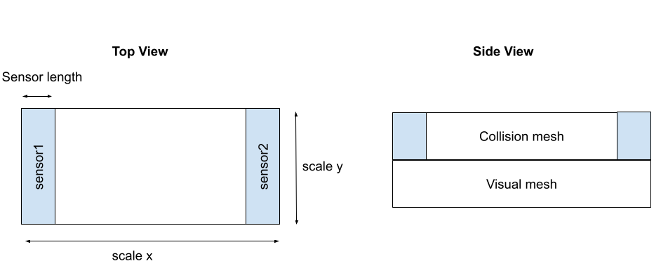
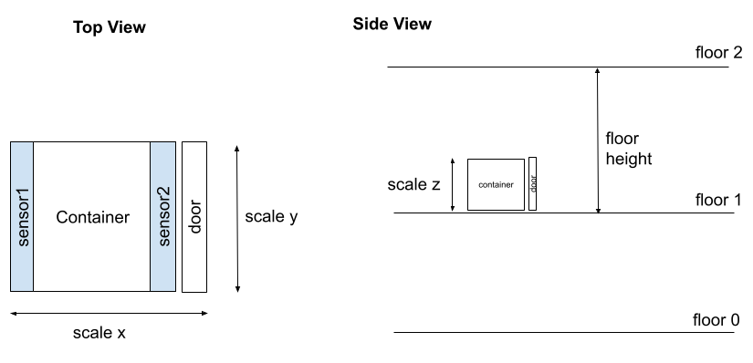
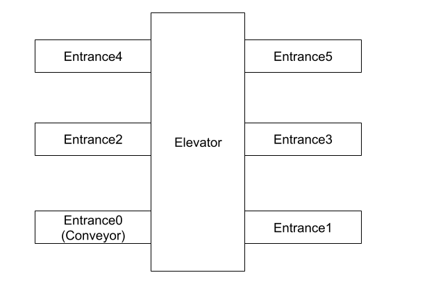

External Devices
===================

.. video:: ../_static/videos/external_devices.mp4
    :width: 750
    :height: 450

External devices are non-robot device such as conveyor, elevator, etc.
External devices are implemented using BP (Blueprint) to allow easy editing 
by non-engineers. Each external device is a child class of `BP_ExternalDeviceBase`, 
which is a child class of `RRBaseRobot`. This setup provides ROS2Node 
and ROS2Interface functionalities.

External devices can be place from editor or spawned from ROS 2  `/SpawnEntity <https://github.com/rapyuta-robotics/UE_msgs/blob/devel/srv/SpawnEntity.srv>`_ .

Following devices only has basic setting such as primitive meshes as visual. 
It is expected that user create child class and change visual mesh, collision size and etc.

Base Class
----------

Overview
^^^^^^^^
Base class is parent class of other External Device BP classes and have common functionalities.

Base ROS Interfaces
^^^^^^^^^^^^^^^^^^^^^^^^

UE external components have ROS 2 Interface which provide

- ROS2 Topic Interface: Two main interface based on modes
    - **Low level interface**  
        e.g. *velocity input and sensor*

        It allow user to create custom behavior of devices
    - **Preset action** 
        e.g. *move pallet from entrance A to entrance B*

        It allow user to test integration with just trigger action. It is also useful to speed up simulation since all logic inside UE.

- Parameters: 
    - **Normal Parameters** 
        e.g. *velocity*
        
        Parameters which can be changed at runtime.
    - **Spawn Parameters** 
        e.g. *size, floor height* 
        
        Parameters which can’t be changed after spawn. Pose and ROS namespace are includes as ue_msgs/SpawnEntity.srv.

Base UE functions
^^^^^^^^^^^^^^^^^^

- ParamParser and ParamParserImpl: 
    These handle JSON parameter parsing.  
    When spawned from ROS, `ParamParser` is called from `BPInitParamParser`.  
    When spawned from Unreal Engine (UE), such as when placed from the editor, 
    `ParamParser` is called from the `Initialize` function. It is expected that 
    parameters will be overwritten by the editor as normal UE Actors.

- InitializeChildActor: 
    Some external devices contain other devices as 
    child actors. For example, a vertical conveyor may have an elevator and 
    conveyors as child actors. The initialization of these child actors, such 
    as passing parameters and setting relative positions, is performed here.

- Construction Script: 
    The construction script calls three functions:  
    1. `InitializeChildActor`  
    2. `Initialize`  
    3. `PostInitialize`

Parameters for BP_ExternalDeviceBase
^^^^^^^^^^^^^^^^^^^^^^^^^^^^^^^^^^^^

.. list-table::
   :header-rows: 1

   * - Param Name
     - Type (Default)
     - Note
   * -  **ROS JSON SPAWN PARAMETER**
     - 
     - 
   * - /debug
     - bool (false)
     - Mainly used to print debug logs.
   * - /mode
     - int (0)
     - Modes such as manual or automatic.
   * - /disable_physics
     - bool (true)
     - Disables physics of the target object during operation.
   * - /size
     - dict {x:1, y:1, z:1}
     - Scale of the external device.
   * -  **BP PARAMETER**
     - 
     - 
   * - ParseParamFromJSON
     - bool (true)
     - Parse parameters from JSON.
   * - DebugParamParser
     - bool (false)
     - Used for debugging the JSON Param Parser.
   * - TestJsonInput
     - string ('')
     - Test JSON input for debugging.

Conveyor
--------

Overview  
^^^^^^^^

The conveyor has collision meshes set to `OverlapAll`. It moves objects 
with a given velocity that overlap with the meshes.

There are two main conveyor types:

- `BP_Conveyor`: A simple straight conveyor.
- `BP_SplineConveyor`: A conveyor that moves along a spline curve.

The conveyor can be controlled by velocity input and has two sensors to detect objects.

   Figure : Conveyor

Conveyor Parameters
^^^^^^^^^^^^^^^^^^^^^^^^

.. list-table::
   :header-rows: 1

   * - Param Name

       [UE name if it is not pascal case of ROS one]
     - Type (Default)
     - Note
   * -  **ROS JSON SPAWN PARAMETER**
     - 
     - 
   * - /mode
     - int32 (0)
     - 
        0. Move until payload exits the area  
        1. Move until it hits the entrance sensor.
   * - /sensor1_transform
     - transform 
        .. code-block:: json
       
          {
              "position": {"x": 97.5, "y": 0, "z": 0},
              "rotation": {"x": 0, "y": 0, "z": 0},
              "size": {"x": 0.05, "y": 1, "z": 0.5}
          }
     - Relative transform of sensor1.
   * - /sensor2_transform
     - transform
        .. code-block:: json
       
          {
              "position": {"x": -97.5, "y": 0, "z": 0},
              "rotation": {"x": 0, "y": 0, "z": 0},
              "size": {"x": 0.05, "y": 1, "z": 0.5}
          }
     - Relative transform of sensor2.
   * - /vel
        [Speed]
     - float (1.0 m/s)
     - Conveyor speed.
   * - /sensor_length
        (BP_Conveyor)
     - float (0.1 m)
     - Sensor area length.
   * - /points
        (BP_SplineConveyor)
     - json
        .. code-block:: json
       
          {
              "position": null,
              "rotation": null,
              "arrive_tangent": null,
              "leave_tangent": null,
              "scale": null
          }
     - Spline points for curve creation.
   * -  **BP PARAMETER**
     - 
     - 
   * - Tag
     - string ('Payload')
     - Actors with this tag are conveyed.

ROS 2 API for Conveyor
^^^^^^^^^^^^^^^^^^^^^^^^

.. list-table::
   :header-rows: 1

   * - Topic Name
     - Msg Type
     - Note
   * - **SUBSCRIBE**
     - 
     - 
   * - /set_vel
     - `example_interfaces/msg/Float32 <https://docs.ros2.org/foxy/api/example_interfaces/msg/Float32.html>`_
     - Conveyor speed. Can be positive or negative.
   * - /set_mode
     - `example_interfaces/msg/Int32 <https://docs.ros2.org/foxy/api/example_interfaces/msg/Int32.html>`_
     - Sets mode:  
       0: Move until payload exits area  
       1: Move until it hits the entrance sensor.
   * - **PUBLISH**
     - 
     - 
   * - /entrance
     - `example_interfaces/msg/Int32MultiArray <https://docs.ros2.org/foxy/api/example_interfaces/msg/Int32MultiArray.html>`_
     - Size = 2. 0: No object, 1: Object detected.

Elevator
--------

Overview  
^^^^^^^^

Elevators consist of containers that move between floors. 
The containers can have doors and conveyors inside to automatically move payloads.

   Figure : Elevator

Elevator Parameters
^^^^^^^^^^^^^^^^^^^^

.. list-table::
   :header-rows: 1

   * - Param Name

       [UE name if it is not pascal case of ROS one]
     - Type (Default)
     - Note
   * -  **ROS JSON SPAWN PARAMETER**
     - 
     - 
   * - /mode
     - int (1)
     - 
       0. Manual mode: Control elevator and doorby velocity input
       1. Normal mode: Control elevator and door by /move_to and /open_door
       2. Auto Move Return mode: Elevator moves to another floor specified in /auto_target_floors when the payload enters and returns to the original floor when objects go outside of the elevator.
   * - /floor_height
     - float (5.0 m)
     - Floor height.
   * - /floors
     - int [2]([0, 1])
     - Floor numbers.
   * - /doors

        [Open Front Door by Floor]
     - bool[2] ([true, false])
     - Door presence.
   * - /door
        [Has Door]
     - bool (true)
     - Door presence.
   * - /door_vel

        [Back/Front Door Speed]
     - float (0.3 m/s)
     - Door speed.
   * - /initial_floor
     - int (0)
     - Initial floor.
   * - /auto_target_floors
     - int [2]([0, 1])
     - Auto mode target floors.
   * - /vel

        [Elevator Speed]
     - float (3.0 m/s)
     - Elevator speed.

ROS 2 API for Elevator
^^^^^^^^^^^^^^^^^^^^^^^^

.. list-table::
   :header-rows: 1

   * - Topic Name
     - Msg Type
     - Note
   * - **SUBSCRIBE**
     - 
     - 
   * - /set_mode
     - `example_interfaces/msg/Int32 <https://docs.ros2.org/foxy/api/example_interfaces/msg/Int32.html>`_
     - 
       0. Manual mode: Control elevator and doorby velocity input
       1. Normal mode: Control elevator and door by /move_to and /open_door
       2. Auto Move Return mode: Elevator moves to another floor specified in /auto_target_floors when the payload enters and returns to the original floor when objects go outside of the elevator.
   * - /set_vel
     - `example_interfaces/msg/Float32 <https://docs.ros2.org/foxy/api/example_interfaces/msg/Float32.html>`_
     - 
        - Mode==0: Move the container. can be +-
        - Mode > 0: set vel which is used to /move_to and automovement.
   * - /set_front_door_vel
     - `example_interfaces/msg/Float32 <https://docs.ros2.org/foxy/api/example_interfaces/msg/Float32.html>`_
     - 
        - Mode==0: Move the door. can be +-
        - Mode > 0: set vel which is used to /move_to and automovement.
   * - /set_back_door_vel
     - `example_interfaces/msg/Float32 <https://docs.ros2.org/foxy/api/example_interfaces/msg/Float32.html>`_
     - 
        - Mode==0: Move the door. can be +-
        - Mode > 0: set vel which is used to /move_to and automovement.
   * - /set_door_vel
     - `example_interfaces/msg/Float32 <https://docs.ros2.org/foxy/api/example_interfaces/msg/Float32.html>`_
     - 
        - Mode==0: Move the door. can be +-
        - Mode > 0: set vel which is used to /move_to and automovement.
   * - /open_door
     - `example_interfaces/msg/Bool <https://docs.ros2.org/foxy/api/example_interfaces/msg/Bool.html>`_
     - Opens or closes the doors.
   * - /move_to
     - `example_interfaces/msg/Int32 <https://docs.ros2.org/foxy/api/example_interfaces/msg/Int32.html>`_
     - Close door, move to the specified floor and open door.
   * - /set_auto_target_floors
     - `example_interfaces/msg/Int32MultiArray <https://docs.ros2.org/foxy/api/example_interfaces/msg/Int32MultiArray.html>`_ [2]
     - Set the target floors for auto mode.
   * - **PUBLISH**
     - 
     - 
   * - /current_floor
     - `example_interfaces/msg/Int32 <https://docs.ros2.org/foxy/api/example_interfaces/msg/Int32.html>`_
     - Current floor.  
       If the floor is moving, it will show the last known floor.
   * - /door_status
     - `example_interfaces/msg/Bool <https://docs.ros2.org/foxy/api/example_interfaces/msg/Bool.html>`_
     - Door status. True = open, False = closed.
   * - **SERVICE**
     - 
     - 
   * - /get_door_status
     - `ue_msgs/srv/GetBoolFromId <https://github.com/rapyuta-robotics/UE_msgs/blob/devel/srv/GetBoolFromId.srv>`_
     - Returns whether the door is open or not.
   * - /get_current_floor
     - `ue_msgs/srv/GetInt32FromId <https://github.com/rapyuta-robotics/UE_msgs/blob/devel/srv/GetInt32FromId.srv>`_
     - Returns the current floor.
   * - /move_to
     - `ue_msgs/srv/SetInt32 <https://github.com/rapyuta-robotics/UE_msgs/blob/devel/srv/SetInt32.srv>`_
     - Close door, move to the specified floor and open door.
   * - /open_door
     - `ue_msgs/srv/SetInt32 <https://github.com/rapyuta-robotics/UE_msgs/blob/devel/srv/SetInt32.srv>`_
     - Opens or closes the doors.

**Todo**  
    - Support multiple type of doors
    - Multiple door location for each floor
    - Test spawning from ROS 2.

Vertical Conveyor
-----------------

Overview
^^^^^^^^

The vertical conveyor is a combination of a conveyor and an elevator. It allows 
for the vertical transport of payloads between multiple levels, and each level 
can have its own entrance and exit conveyors.

   Figure : Vertical Conveyor

Vertical Conveyor Parameters
^^^^^^^^^^^^^^^^^^^^^^^^^^^^^^^^

.. list-table::
   :header-rows: 1

   * - Param Name
     - Type (Default)
     - Note
   * -  **ROS JSON SPAWN PARAMETER**
     - 
     - 
   * - /floor_height
     - float (10 m)
     - Distance between floors.
   * - /entrances
     - int32 [4]([false, true, false, true])
     - Define if each entrance is active.  
       0. no entrance,  
       1. entrance active.
   * - /target_entrance
     - int8 [2]([0, 1])
     - Target entrance, [in, out].
   * - /elevator
     - string ('')
     - JSON spawn parameter to pass to the child elevator actor.
   * - /entrance
     - string ('')
     - JSON spawn parameter to pass to child entrance conveyor actors.
   * -  **BP PARAMETER**
     - 
     - 
   * - EntranceActorClass
     - ActorClass(BP_Conveyor)
     - Entrance conveyor class
     
ROS 2 API for Vertical Conveyor
^^^^^^^^^^^^^^^^^^^^^^^^^^^^^^^^

.. list-table::
   :header-rows: 1

   * - Topic Name
     - Msg Type
     - Note
   * - /set_target_entrance
     - `example_interfaces/msg/Int32MultiArray <https://docs.ros2.org/foxy/api/example_interfaces/msg/Int32MultiArray.html>`_ [2]
     - Sets the target entrance, [in, out].

**Todo**  
    - Support different parameter settings for each entrance.
    - Test spawning from ROS 2.
